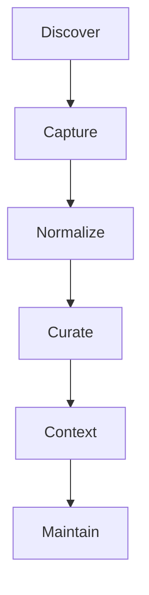

# Comandos

## Resumen

Esta página explica el contrato de uso del skill por intención, no por internals.

La fuente ejecutable de referencia es siempre `./bin/mi-memoria capabilities --json`.

Si un comando no aparece ahí, no debe documentarse como disponible.

## Desarrollo

### Cómo leer esta guía

- Los comandos están agrupados por intención.
- Los ejemplos de activación usan `prompt`.
- Los comandos técnicos usan `bash`.
- Los bloques muestran el uso mínimo útil, no la exhaustividad de flags.
- Cuando un comando produce preview, revisa el archivo generado antes de aplicar cambios.

### Activación en lenguaje natural

Usa este formato cuando estés en un coding CLI, un agente o una interfaz conversacional que cargue el skill.

```prompt
/mi-memoria organiza esta nota sobre arquitectura
/mem normaliza esta idea rápida
$mi-memoria clasifica este Markdown
$mem guarda esta decisión como memoria
```

```prompt
Normaliza esta nota sobre arquitectura.
Convierte esta idea en una nota estructurada.
Clasifica este Markdown.
Guarda esta decisión como memoria.
```

Estas formas activan el mismo runtime. El prefijo puede variar según el agente, pero la intención es la misma.

### Comandos técnicos

Usa `bash` cuando ejecutes el binario local, actualices el runtime, inicialices un vault o trabajes con previews y plantillas.

### Descubrimiento

| Comando | Uso |
|---|---|
| `explain` | describe el runtime |
| `context` | muestra contexto y vault |
| `capabilities` | expone contrato y metadata |

```bash
./bin/mi-memoria explain --json
./bin/mi-memoria context --json
./bin/mi-memoria capabilities --json
```

`explain` sirve para entender el runtime en lenguaje humano.

`context` devuelve el estado operativo local y, si existe, el vault configurado.

`capabilities` es la fuente canónica para saber qué comandos existen, qué tipos acepta el CLI y qué metadata ve un agente.

### Captura y normalización

| Comando | Uso |
|---|---|
| `capture` | captura ideas o notas rápidas |
| `daily` | registra trabajo diario |
| `decision` | guarda decisiones trazables |
| `run normalize` | genera una nota estándar |
| `validate` | verifica estructura |
| `apply` | promueve previews al vault |

```bash
./bin/mi-memoria capture --kind idea --text "Idea rápida" --json
./bin/mi-memoria capture --kind decision --text "Separar runtime y vault" --json
./bin/mi-memoria daily --append "Nota rápida" --json
./bin/mi-memoria decision new --title "Separar runtime y vault" --decision-status accepted --json
./bin/mi-memoria run normalize --input note.md --preview --json
./bin/mi-memoria validate --input note.md --json
./bin/mi-memoria apply --input workspace/preview/note.md --vault-path /path/to/vault --json
```

`capture` es la puerta de entrada para ideas, referencias o notas rápidas.

`daily` agrupa trabajo del día sin forzar clasificación inmediata.

`decision` registra acuerdos con trazabilidad.

`run normalize` produce una nota curada en preview o escritura controlada.

`validate` comprueba estructura y frontmatter.

`apply` promueve un preview ya revisado al destino final del vault.

### Curación

| Comando | Uso |
|---|---|
| `classify` | sugiere destino sin mover |
| `review` | emite reporte de calidad |
| `link` | sugiere wikilinks |
| `summarize` | sintetiza notas o carpetas |
| `index` | crea índice navegable |
| `timeline` | crea línea temporal |
| `drift-detection` | detecta deriva |
| `curate` | propone plan de curaduría |
| `publish` | exporta subconjuntos |
| `archive` | archiva con control explícito |

```bash
./bin/mi-memoria classify --input workspace/inbox/nota.md --json
./bin/mi-memoria review --path workspace/inbox --json
./bin/mi-memoria link --input workspace/inbox/nota.md --preview --json
./bin/mi-memoria summarize --path workspace/inbox --json
./bin/mi-memoria index --path workspace/inbox --json
./bin/mi-memoria timeline --path workspace/inbox --json
./bin/mi-memoria drift-detection --path workspace/inbox --json
./bin/mi-memoria curate --path workspace/inbox --json
./bin/mi-memoria publish --path workspace/inbox --format markdown --output workspace/exports/pack --json
./bin/mi-memoria archive --input 30-resources/nota.md --preview --vault-path /path/to/vault --json
```

`classify` propone destino y alternativas sin mover archivos.

`review` genera reportes verificables con hallazgos estructurales.

`link` sugiere relaciones internas, pero no escribe enlaces automáticamente.

`summarize` condensa una nota o carpeta con fuentes trazables.

`index` crea navegación y detecta duplicados.

`timeline` convierte fechas en una línea de tiempo útil para revisión histórica.

`drift-detection` detecta deriva taxonómica o estructural.

`curate` sugiere una ruta de curaduría antes de mutar el vault.

`publish` exporta subconjuntos de conocimiento sin tocar fuentes.

`archive` mueve material a `40-archive` solo con intención explícita.

### Contexto local

| Comando | Uso |
|---|---|
| `query` | consulta con evidencia |
| `context-build` | prepara context packs |
| `session` | maneja sesiones temporales |

```bash
./bin/mi-memoria query "runtime separado del vault" --path . --json
./bin/mi-memoria context-build --topic "taxonomía documental" --path . --json
./bin/mi-memoria session start --name arquitectura-mi-memoria --json
./bin/mi-memoria session add --name arquitectura-mi-memoria --input workspace/inbox/nota.md --json
./bin/mi-memoria session context --name arquitectura-mi-memoria --json
./bin/mi-memoria session close --name arquitectura-mi-memoria --remember --json
```

`query` es útil cuando quieres una respuesta con evidencia y nivel de incertidumbre.

`context-build` prepara un paquete de contexto reutilizable para documentación o trabajo analítico.

`session` agrupa trabajo temporal y permite cerrar el contexto sin persistencia automática.

### Plantillas y mantenimiento

| Comando | Uso |
|---|---|
| `template` | lista, genera, valida y aplica plantillas |
| `template sync` | sincroniza plantillas base |
| `remember` | guarda memoria curada |
| `upgrade` | actualiza el runtime con `git pull --ff-only` |

```bash
./bin/mi-memoria template list --json
./bin/mi-memoria template show --name note --vault-path /path/to/vault
./bin/mi-memoria template generate --name log-diario --type note --description "Registro diario de eventos" --preview --json
./bin/mi-memoria template validate --input workspace/preview/templates/log-diario.md --json
./bin/mi-memoria template apply --input workspace/preview/templates/log-diario.md --vault-path /path/to/vault --json
./bin/mi-memoria template sync --vault-path /path/to/vault --json
./bin/mi-memoria remember --summary "Convención aprobada: usar sentence case." --vault-path /path/to/vault --json
./bin/mi-memoria upgrade --json
```

`template` permite listar, mostrar, generar, validar, aplicar y sincronizar plantillas.

`remember` guarda memoria curada en el vault por defecto; usa `--scope runtime` solo para comportamiento interno del skill.

`upgrade` actualiza el runtime con `git pull --ff-only` y no ejecuta comandos arbitrarios.

### Setup y actualización

```bash
./scripts/skill_setup.sh /path/to/mi-memoria-vault
./bin/mi-memoria upgrade --json
```

`skill_setup.sh` crea la estructura mínima del vault y copia plantillas base sin sobrescribir contenido existente.

`upgrade` actualiza únicamente el runtime del skill.

## Escenarios guiados

### Capturar una idea y revisarla

```bash
./bin/mi-memoria capture --kind idea --text "Separar docs de memoria curada" --json
./bin/mi-memoria review --path workspace/inbox --json
./bin/mi-memoria classify --input workspace/inbox/2026-05-11-idea.md --json
```

### Normalizar una nota y aplicarla al vault

```bash
./bin/mi-memoria run normalize --input note.md --preview --vault-path /path/to/vault --json
./bin/mi-memoria validate --input workspace/preview/note.md --json
./bin/mi-memoria apply --input workspace/preview/note.md --vault-path /path/to/vault --json
```

### Construir contexto para documentación

```bash
./bin/mi-memoria context-build --topic "documentación de usuario" --path . --json
./bin/mi-memoria publish --context-pack workspace/exports/2026-05-10-context-pack.json --output workspace/exports/doc-pack --format markdown --json
```

### Usar el skill en un agente

```prompt
/mi-memoria context-build para documentar el corpus de roadmap
/mem review esta carpeta de notas y sugiere una ruta de curaduría
```

```prompt
Organiza el contenido de `docs/30-resources/mi-memoria/commands.md` para que sea más ilustrativo.
```

### Registrar una decisión

```bash
./bin/mi-memoria decision new --title "Adoptar sentence case" --decision-status accepted --json
./bin/mi-memoria remember --type decision --summary "Se adopta sentence case en títulos visibles." --vault-path /path/to/vault --json
```

## Diagrama



## Relaciones

- [quickstart](./quickstart.md)
- [manifests](./manifests.md)
- [workflows](./workflows.md)
- [troubleshooting](./troubleshooting.md)
- [usage](../../usage.md)
- [activation](../../activation.md)
- [architecture](../../architecture.md)
- [capabilities manifest](../../../skill-manifest.json)

## Pendientes

- En la siguiente iteración, agregar una tabla de salidas JSON mínimas por comando.
- En una revisión posterior, separar ejemplos por nivel de usuario: básico, intermedio y mantenimiento.
