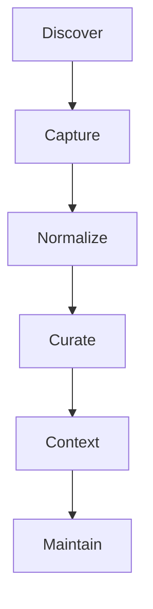

# Comandos

## Resumen

Los comandos se agrupan por intención. La salida ejecutable de referencia es `./bin/mi-memoria capabilities --json`.

## Desarrollo

### Descubrimiento

| Comando | Uso |
|---|---|
| `explain` | describe el runtime |
| `context` | muestra contexto y vault |
| `capabilities` | expone contrato y metadata |

### Captura y normalización

| Comando | Uso |
|---|---|
| `capture` | captura ideas o notas rápidas |
| `daily` | registra trabajo diario |
| `decision` | guarda decisiones trazables |
| `run normalize` | genera una nota estándar |
| `validate` | verifica estructura |
| `apply` | promueve previews al vault |

### Curation

| Comando | Uso |
|---|---|
| `classify` | sugiere destino sin mover |
| `review` | emite reporte de calidad |
| `link` | sugiere wikilinks |
| `summarize` | sintetiza notas o carpetas |
| `index` | crea índice navegable |
| `timeline` | crea línea temporal |
| `drift-detection` | detecta deriva |
| `curate` | propone plan de curaduría |
| `publish` | exporta subconjuntos |
| `archive` | archiva con control explícito |

### Contexto local

| Comando | Uso |
|---|---|
| `query` | consulta con evidencia |
| `context-build` | prepara context packs |
| `session` | maneja sesiones temporales |

### Plantillas y mantenimiento

| Comando | Uso |
|---|---|
| `template` | lista, genera, valida y aplica plantillas |
| `template sync` | sincroniza plantillas base |
| `remember` | guarda memoria curada |
| `upgrade` | actualiza el runtime con `git pull --ff-only` |

## Diagrama

## Relaciones

- [quickstart](./quickstart.md)
- [manifests](./manifests.md)
- [workflows](./workflows.md)
- [troubleshooting](./troubleshooting.md)
- [capabilities manifest](../../../skill-manifest.json)

## Pendientes

- En la siguiente iteración, derivar una tabla rápida por comando con ejemplos de salida JSON.
