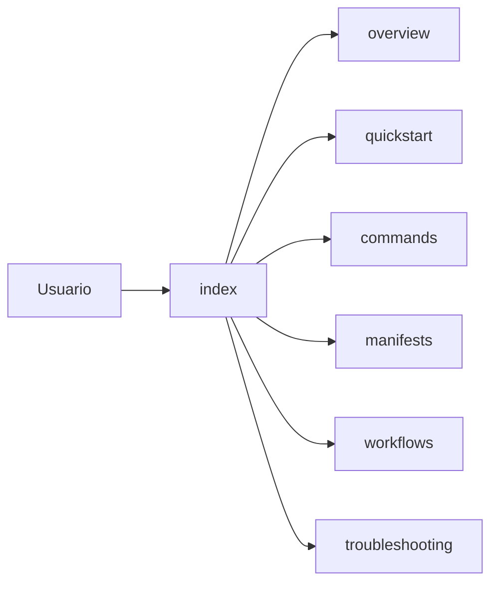

# Documentación de usuario

## Resumen

Este paquete reúne la documentación pensada para usuarios del skill y del proyecto:

- ¿qué es `mi-memoria`?;
- cómo se usa;
- qué comandos tiene;
- cómo interpretar manifests y capacidades;
- qué hacer cuando algo falla.

La capa de gobernanza vive en `docs/memory/`. Esta capa vive aquí: `docs/30-resources/mi-memoria/`.

## Desarrollo

Ruta de lectura recomendada:

1. [overview](./overview.md)
2. [quickstart](./quickstart.md)
3. [commands](./commands.md)
4. [manifests](./manifests.md)
5. [workflows](./workflows.md)
6. [troubleshooting](./troubleshooting.md)

## Relaciones

- [architecture](../../architecture.md)
- [usage](../../usage.md)
- [documentation-governance](../../documentation-governance.md)
- [scope-governance](../../scope-governance.md)
- [documentation-taxonomy](../../memory/conventions/documentation-taxonomy.md)
- [roadmap curado](../../memory/roadmap/README.md)

## Pendientes

- En la siguiente iteración, enlazar esta documentación desde el [README.md](../../../README.md) raíz.
- Revisar si el paquete necesita notas adicionales por instalación o despliegue.

## Ver también

- [30 Resources](../README.md)
- [Memory README](../../memory/README.md)
- [Roadmap curado](../../memory/roadmap/README.md)
