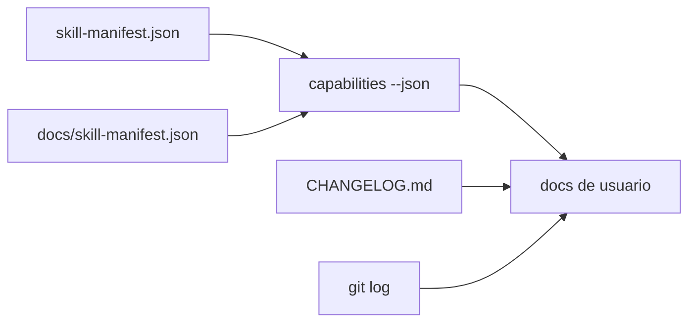

# Manifests y Capacidades

## Resumen

Este proyecto tiene dos planos de contrato:

- manifiesto machine-first;
- contrato ejecutable del binario.

El binario manda para el usuario. Los manifests sostienen metadata y compatibilidad de agentes.

## Desarrollo

### Fuentes

| Fuente | Rol |
|---|---|
| `skill-manifest.json` | contrato canónico de metadata |
| `docs/skill-manifest.json` | espejo compatible |
| `./bin/mi-memoria capabilities --json` | verdad ejecutable actual |
| `CHANGELOG.md` | historia de releases y fases |
| `git log` | contexto de evolución |

### Cómo leerlo

1. Si quieres saber qué hace hoy el runtime, usa `capabilities --json`.
2. Si quieres saber cómo se describe para agentes, lee `skill-manifest.json`.
3. Si quieres entender cambios y madurez, revisa `CHANGELOG.md`.
4. Si quieres ver la intención histórica, usa `git log`.

## Diagrama

## Observación operativa

El manifiesto y el binario deben converger. Si aparece diferencia, la lectura confiable para uso diario es la salida ejecutable, y la documentación debe señalar la discrepancia hasta que se alinee.

## Relaciones

- [overview](./overview.md)
- [commands](./commands.md)
- [troubleshooting](./troubleshooting.md)
- [roadmap curado](../../memory/roadmap/README.md)

## Pendientes

- Añadir una mini tabla de compatibilidad de versión cuando se estabilice la siguiente release.
