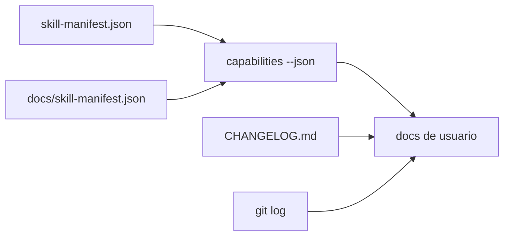

# Manifests y capacidades

## Resumen

Esta página explica el contrato técnico y documental de `mi-memoria`.

Hay dos planos de verdad que deben convivir:

- el manifiesto machine-first;
- la salida ejecutable del binario.

El binario manda para el uso diario. Los manifests sostienen metadata, compatibilidad de agentes y trazabilidad.

## Desarrollo

### Fuentes

| Fuente | Rol |
|---|---|
| `skill-manifest.json` | contrato canónico de metadata |
| `docs/skill-manifest.json` | espejo compatible |
| `./bin/mi-memoria capabilities --json` | verdad ejecutable actual |
| `CHANGELOG.md` | historia de releases y fases |
| `git log` | contexto de evolución |

### Cómo leer esta guía

- Los ejemplos de orientación usan `prompt`.
- Los ejemplos de verificación usan `bash`.
- El manifiesto canónico vive en la raíz del repo.
- El espejo en `docs/skill-manifest.json` debe permanecer idéntico.
- Si hay divergencia, la salida ejecutable es la referencia para el usuario y la documentación debe señalar el desvío.

### Lectura en lenguaje natural

Usa este formato cuando estés en un agente o coding CLI y quieras entender el contrato antes de ejecutar nada.

```prompt
Explícame qué comandos expone mi-memoria hoy.
Compara el manifiesto canónico con la salida de capacidades.
Resume qué diferencia hay entre skill-manifest.json y capabilities --json.
Muéstrame si existe deriva entre la documentación y el binario.
```

```prompt
¿Qué significa que el manifiesto sea machine-first?
¿Qué debo revisar antes de confiar en una capacidad nueva?
¿Cuál es la fuente de verdad para uso diario?
```

### Verificación técnica

Usa `bash` cuando quieras inspeccionar el contrato real del repositorio o comparar artefactos.

```bash
./bin/mi-memoria capabilities --json
diff -u skill-manifest.json docs/skill-manifest.json
rg -n '"version"|\"maturity\"|\"commands\"' skill-manifest.json docs/skill-manifest.json
git log --oneline -- CHANGELOG.md skill-manifest.json docs/skill-manifest.json
```

Lectura recomendada:

1. Si quieres saber qué hace hoy el runtime, usa `./bin/mi-memoria capabilities --json`.
2. Si quieres saber cómo se describe para agentes, lee `skill-manifest.json`.
3. Si quieres comprobar compatibilidad, revisa `docs/skill-manifest.json`.
4. Si quieres entender cambios y madurez, revisa `CHANGELOG.md`.
5. Si quieres ver intención histórica, usa `git log`.

### Qué contiene el manifiesto

- nombre del skill;
- versión visible;
- madurez operativa;
- comandos soportados;
- tipos soportados;
- estados y destinos;
- metadata por comando;
- ejemplos mínimos por comando.

## Diagrama



## Observación operativa

El manifiesto y el binario deben converger.

Si aparece diferencia:

- la lectura confiable para uso diario es la salida ejecutable;
- la documentación debe señalar la discrepancia;
- el espejo de `docs/skill-manifest.json` no debe divergir del canónico;
- el cambio debe quedar trazado en `CHANGELOG.md` o en una memoria curada.

## Relaciones

- [overview](./overview.md)
- [commands](./commands.md)
- [troubleshooting](./troubleshooting.md)
- [documentación de usuario](./index.md)
- [roadmap curado](../../memory/roadmap/README.md)

## Pendientes

- Añadir una mini tabla de compatibilidad de versión cuando se estabilice la siguiente release.
- Añadir ejemplos de comparación entre `capabilities --json` y `skill-manifest.json` si vuelve a aparecer drift.
