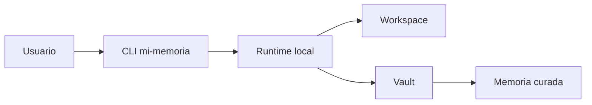

# Resumen Operativo

## Resumen

`mi-memoria` es un runtime local para organizar conocimiento Markdown sin mezclar lógica operacional dentro del vault.

## Desarrollo

- captura notas e ideas;
- normaliza Markdown a notas consistentes;
- clasifica sin mover automáticamente;
- revisa calidad y deriva;
- sintetiza, enlaza y publica;
- construye contexto y sesiones locales.

## Qué no hace

- no requiere APIs externas para funcionar;
- no actúa como agente autónomo;
- no escribe en el vault sin intención explícita;
- no convierte el vault en runtime.

## Diagrama

## Relaciones

- [quickstart](./quickstart.md)
- [commands](./commands.md)
- [manifests](./manifests.md)
- [workflows](./workflows.md)
- [memory README](../../memory/README.md)
- [documentation governance](../../documentation-governance.md)

## Pendientes

- Completar el enlace desde el [README.md maestro](../../../README.md) del proyecto en la siguiente iteración.
