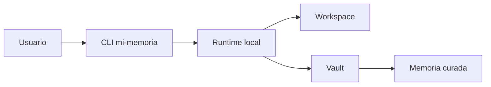

# Resumen operativo

## Resumen

`mi-memoria` es un runtime local para organizar conocimiento Markdown sin mezclar lógica operacional dentro del vault.

La idea central es simple:

- el runtime ejecuta;
- el vault conserva conocimiento;
- la curaduría decide qué pasa de uno a otro.

## Desarrollo

### Lectura en lenguaje natural

Usa este formato cuando quieras entender el producto sin entrar al CLI todavía.

```prompt
Explícame qué hace mi-memoria en una sola frase.
Resume cómo se separan runtime y vault.
Dime en qué momento una nota deja de ser borrador y pasa a memoria curada.
```

```prompt
¿Qué tipo de trabajo debo dejar en workspace y cuál en el vault?
¿Por qué el skill usa preview antes de apply?
¿Qué parte del sistema es memoria y cuál es operación?
```

### Verificación técnica

Usa `bash` cuando quieras ver el comportamiento real del repo o confirmar capacidades.

```bash
./bin/mi-memoria explain --json
./bin/mi-memoria context --json
./bin/mi-memoria capabilities --json
```

### Qué hace

- captura notas e ideas;
- normaliza Markdown a notas consistentes;
- clasifica sin mover automáticamente;
- revisa calidad y deriva;
- sintetiza, enlaza y publica;
- construye contexto y sesiones locales.

## Qué no hace

- no requiere APIs externas para funcionar;
- no actúa como agente autónomo;
- no escribe en el vault sin intención explícita;
- no convierte el vault en runtime.

### Qué conviene recordar

- `workspace/` es staging;
- `docs/30-resources/` es documentación de usuario;
- `docs/memory/` es memoria curada y gobernanza;
- `README.md` y `SKILL.md` apuntan al mismo corpus curado.

## Diagrama



## Relaciones

- [quickstart](./quickstart.md)
- [commands](./commands.md)
- [manifests](./manifests.md)
- [workflows](./workflows.md)
- [memory README](../../memory/README.md)
- [documentation governance](../../documentation-governance.md)
- [editorial style](../../memory/conventions/editorial-style.md)

## Pendientes

- Completar el enlace desde el [README.md maestro](../../../README.md) del proyecto en la siguiente iteración.
- Añadir una mini tabla de “qué archivo leer primero” por tipo de usuario.
