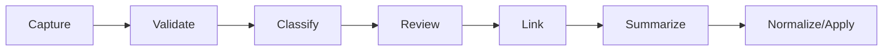

# Inicio rápido

## Resumen

Este es el camino corto para empezar sin pelear con el sistema:

1. inicializa o apunta a un vault;
2. captura una nota;
3. normaliza o valida;
4. clasifica;
5. revisa;
6. aplica o archiva de forma explícita.

## Desarrollo

### Lectura en lenguaje natural

Usa este formato cuando estés en un agente, un coding CLI o una interfaz conversacional que cargue el skill.

```prompt
/mi-memoria ayúdame a empezar con este vault.
/mem dime cuál es el flujo mínimo para capturar y aplicar una nota.
$mi-memoria normaliza esta idea antes de moverla al vault.
```

```prompt
Configura un flujo mínimo para usar mi-memoria con un vault externo.
Explícame qué hago primero: capturar, validar o clasificar.
Muéstrame el camino corto para llevar una idea a memoria curada.
```

### Comandos técnicos

Usa `bash` cuando inicialices el vault, exportes variables o ejecutes el binario real.

```bash
./scripts/skill_setup.sh /path/to/mi-memoria-vault
export MI_MEMORIA_VAULT_PATH=/path/to/mi-memoria-vault
./bin/mi-memoria capabilities --json
./bin/mi-memoria capture --kind idea --text "Idea rápida" --json
./bin/mi-memoria validate --input workspace/inbox/<nota>.md --json
```

## Primeros pasos

La secuencia mínima es vault, captura, validación y clasificación.

```prompt
Ya tengo un vault configurado: ¿qué hago ahora?
```

Respuesta práctica:

1. captura una idea;
2. valida si ya tiene forma;
3. clasifícala sin mover;
4. revisa el resultado;
5. aplica solo si el preview está correcto.

## Flujo mínimo recomendado



## Atajos útiles

```prompt
Muéstrame el estado del runtime.
Ayúdame a buscar contexto sobre una nota.
```

```bash
./bin/mi-memoria context --json
./bin/mi-memoria query "..." --path . --json
./bin/mi-memoria template list --json
./bin/mi-memoria remember --summary "Convención aprobada: usar sentence case." --vault-path /path/to/vault --json
./bin/mi-memoria context-build --topic "inicio rápido" --path . --json
```

## Relaciones

- [overview](./overview.md)
- [commands](./commands.md)
- [workflows](./workflows.md)
- [editorial style](../../memory/conventions/editorial-style.md)

## Pendientes

- Añadir ejemplos más específicos por tipo de usuario cuando el README maestro se enlace.
- Agregar una mini ruta para usuarios que empiezan directamente con `remember` o `context-build`.
