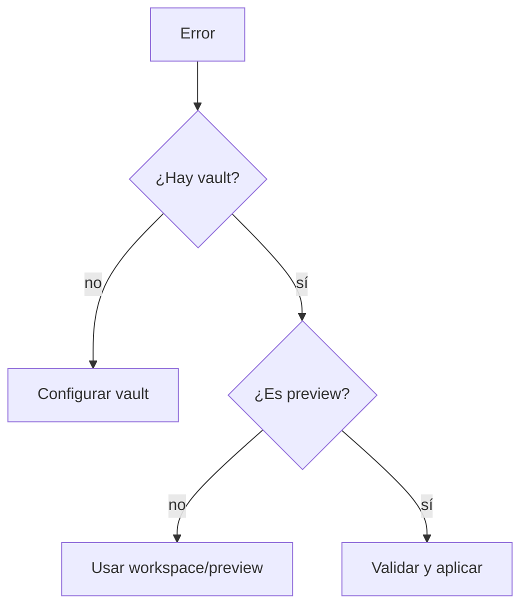

# Troubleshooting

## Resumen

Esta página recoge los fallos más probables y cómo resolverlos sin romper el vault.

## Desarrollo

### Problemas frecuentes

| Síntoma | Causa probable | Acción |
|---|---|---|
| `Falta vault` | no se indicó vault | usa `--vault-path` o `MI_MEMORIA_VAULT_PATH` |
| `apply` falla | el input no está en preview | usa un archivo dentro de `workspace/preview` |
| `validate` falla por nombre | el nombre no cumple convención | usa `slug.md` o `yyyy-mm-dd-slug.md` |
| `template apply` no escribe | el destino ya existe | crea un nombre nuevo o sincroniza faltantes |
| `remember` no escribe | falta vault | configura vault explícito |
| `capabilities` no coincide | drift entre docs y binario | toma el binario como verdad y alinea docs |

### Checklist rápido

1. ¿El vault está configurado?
2. ¿El archivo está en la carpeta correcta?
3. ¿La acción exige `preview` antes de `apply`?
4. ¿La salida esperada está cubierta por `capabilities --json`?

## Diagrama

## Relaciones

- [overview](./overview.md)
- [quickstart](./quickstart.md)
- [commands](./commands.md)
- [manifests](./manifests.md)
- [documentation governance](../../documentation-governance.md)

## Pendientes

- Añadir diagnósticos por comando cuando aparezcan patrones nuevos de soporte.
